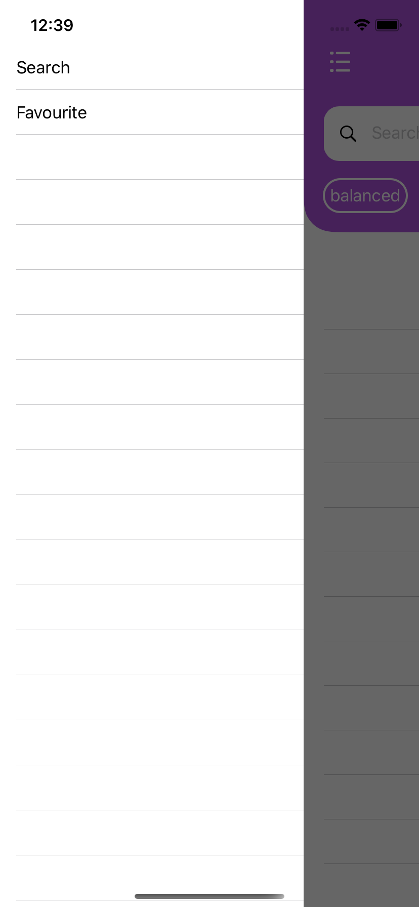
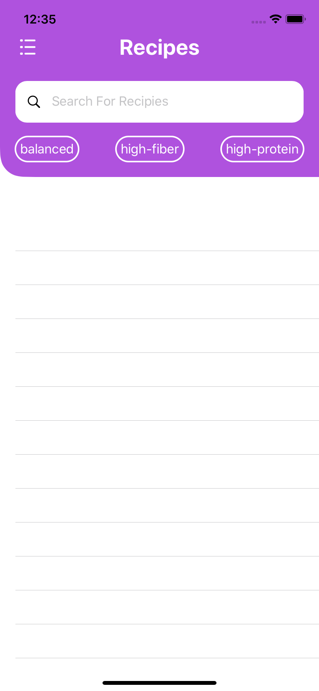
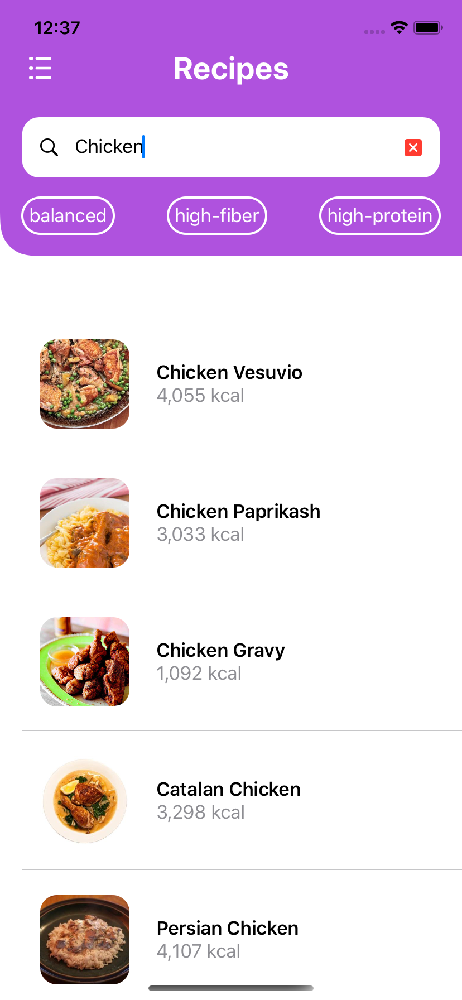
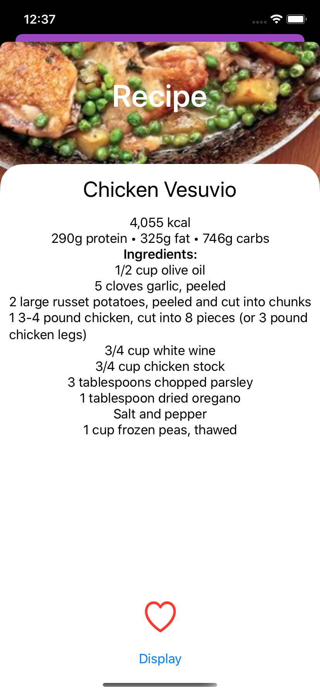
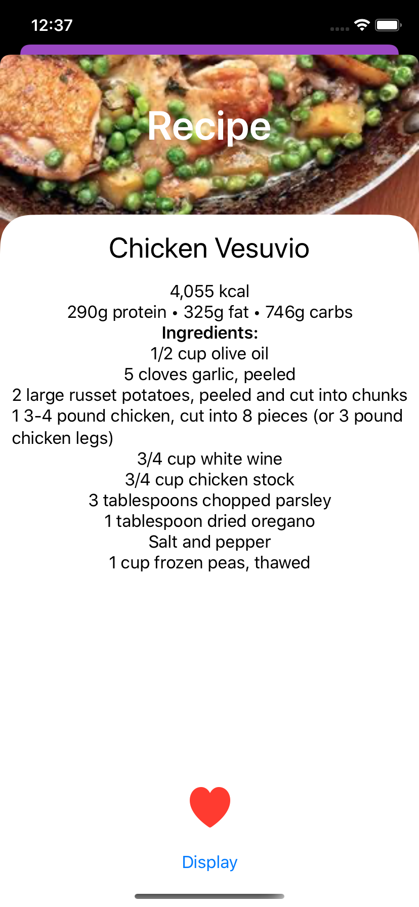

# Book-of-recipes

- SwiftUI
- Timer
- [Alamofire](https://github.com/Alamofire/Alamofire)
- [SwiftyJSON](https://github.com/SwiftyJSON/SwiftyJSON)
- [SDWebImageSwiftUI](https://github.com/SDWebImage/SDWebImageSwiftUI)
- [RealmSwift](https://github.com/realm)

## Sreens

     
